# RIS – spletna aplikacija za upravljanje receptov

RIS je full-stack spletna aplikacija za upravljanje kuharskih receptov.  
Uporabniku omogoča dodajanje, urejanje, brisanje, pregledovanje in izvoz receptov v PDF prek React frontenda, ki komunicira s Spring Boot REST API-jem in MySQL podatkovno bazo.

---

## Vsebina

- [Glavne funkcionalnosti](#glavne-funkcionalnosti)
- [Arhitektura](#arhitektura)
- [Uporabljene tehnologije](#uporabljene-tehnologije)
- [Struktura projekta](#struktura-projekta)
- [Namestitev in zagon](#namestitev-in-zagon)
    - [Predpogoji](#predpogoji)
    - [Konfiguracija podatkovne baze](#konfiguracija-podatkovne-baze)
    - [Konfiguracija backenda](#konfiguracija-backenda)
    - [Konfiguracija frontenda](#konfiguracija-frontenda)
    - [Zagon backenda](#zagon-backenda)
    - [Zagon frontenda](#zagon-frontenda)
- [Model podatkov](#model-podatkov)
- [REST API dokumentacija](#rest-api-dokumentacija)
    - [Pregled](#pregled)
    - [Shema objekta Recipe](#shema-objekta-recipe)
    - [Seznam API končnih točk](#seznam-api-končnih-točk)
    - [Podrobnosti posameznih končnih točk](#podrobnosti-posameznih-končnih-točk)
- [Uporaba aplikacije (frontend)](#uporaba-aplikacije-frontend)
- [Možne izboljšave](#možne-izboljšave)
- [Licenca](#licenca)
- [Razredni diagram (predlagana razširitev)](#razredni-diagram-predlagana-razširitev)

---

## Glavne funkcionalnosti

- prikaz seznama vseh receptov
    - preprosta paginacija na frontendu (privzeto 5 receptov na stran)
- prikaz podrobnosti posameznega recepta
- dodajanje novega recepta
- urejanje obstoječega recepta
- brisanje recepta
- izvoz recepta v PDF (gumb **Download PDF** na strani s podrobnostmi recepta)
- ločen **frontend** (React) in **backend** (Spring Boot)
- komunikacija prek JSON REST API-ja
- osnovna obravnava napak (npr. recept ne obstaja → HTTP 404 z JSON odzivom)

---

## Arhitektura

Aplikacija je razdeljena na dva dela:

- **Backend** – Spring Boot REST API
    - izpostavlja CRUD končne točke za entiteto `Recipe`
    - uporablja Spring Data JPA za dostop do MySQL
    - Hibernate ob zagonu po potrebi ustvari/posodobi shemo baze
    - `@CrossOrigin("http://localhost:3001")` omogoča klice iz React frontenda

- **Frontend** – React enostranska aplikacija (SPA)
    - uporablja Axios za klice na REST API
    - omogoča pregled, dodajanje, urejanje in brisanje receptov
    - vsebuje preprosto paginacijo seznama receptov
    - omogoča izvoz posameznega recepta v PDF z uporabo `jsPDF`

---

## Uporabljene tehnologije

**Backend**

- Java 17
- Spring Boot 3 (Web, Spring Data JPA)
- Hibernate (prek Spring Data JPA)
- MySQL
- Maven
- Lombok (trenutno ni nujno uporabljen, je pa dodan kot odvisnost)
- Spring Boot DevTools (za razvoj)

**Frontend**

- React (Create React App)
- React Router
- Axios
- Bootstrap 5
- jsPDF (generiranje PDF izpisa receptov)
- Node.js / npm

---

## Struktura projekta

```text
RIS/
├─ backend/                  # Spring Boot REST API
│  ├─ src/main/java/
│  │   └─ com/projekt/fullstack_backend/
│  │        ├─ FullstackBackendApplication.java
│  │        └─ ServletInitializer.java
│  ├─ src/test/java/
│  │   └─ com/projekt/fullstack_backend/
│  │        ├─ model/Recipe.java
│  │        ├─ repository/RecipeRepository.java
│  │        ├─ controller/RecipeController.java
│  │        └─ exception/
│  │             ├─ RecipeNotFoundException.java
│  │             └─ RecipeNotFoundAdvice.java
│  └─ src/main/resources/
│       └─ application.properties
│
└─ front/                    # React uporabniški vmesnik
   ├─ src/layout/            # postavitev (npr. navbar)
   ├─ src/pages/             # glavne strani (Home)
   └─ src/recipes/           # komponenta za seznam, dodajanje, urejanje, ogled receptov
```

> Priporočilo: produkcijska koda (`Recipe`, `RecipeController`, `RecipeRepository`, `RecipeNotFoundException`, `RecipeNotFoundAdvice`) naj bo v `src/main/java`, ne v `src/test/java`. Trenutno so ti razredi še v testnem paketu.

---

## Namestitev in zagon

### Predpogoji

- **Java** 17+
- **Maven** 3.x
- **Node.js** 16+ (priporočeno 18+)
- **npm**
- **MySQL** strežnik

### Konfiguracija podatkovne baze

1. Ustvarite bazo:

   ```sql
   CREATE DATABASE RIS
     CHARACTER SET utf8mb4
     COLLATE utf8mb4_unicode_ci;
   ```

2. Ustvarite uporabnika (po želji) ali uporabite `root`:

   ```sql
   CREATE USER 'ris_user'@'localhost' IDENTIFIED BY 'močno_geslo';
   GRANT ALL PRIVILEGES ON RIS.* TO 'ris_user'@'localhost';
   FLUSH PRIVILEGES;
   ```

### Konfiguracija backenda

Datoteka: `backend/src/main/resources/application.properties` (trenutno stanje):

```properties
spring.application.name=fullstack-backend

# Hibernate – samodejna kreacija/posodobitev sheme
spring.jpa.hibernate.ddl-auto=update

# Povezava na MySQL (privzeto root brez gesla)
spring.datasource.url=jdbc:mysql://localhost:3306/RIS
spring.datasource.username=root
spring.datasource.password=
spring.datasource.driver-class-name=com.mysql.cj.jdbc.Driver

# Port backenda
server.port=8081
```

Za bolj varno nastavitev je priporočljivo uporabiti ločenega uporabnika (npr. `ris_user`):

```properties
spring.datasource.username=ris_user
spring.datasource.password=močno_geslo
```

in v MySQL konfiguraciji ustrezno ustvariti uporabnika (glej zgoraj).

### Konfiguracija frontenda

V mapi `front` lahko po potrebi dodate datoteko `.env`:

```env
PORT=3001
```

Frontend bo privzeto poslušal na `http://localhost:3001`, REST API pa na `http://localhost:8081`.

Axios klici v React komponentah trenutno uporabljajo fiksni URL:

- `http://localhost:8081/recipes`
- `http://localhost:8081/recipe/{id}`

Po želji lahko kasneje uvedete spremenljivko okolja (npr. `REACT_APP_API_BASE_URL`) in jo v komponentah uporabite namesto hardcodanega URL-ja.

Za PDF funkcionalnost poskrbite, da je knjižnica `jspdf` nameščena:

```bash
cd front
npm install jspdf
```

### Zagon backenda

```bash
cd backend
mvn clean install
mvn spring-boot:run
```

Backend bo na:  
`http://localhost:8081`

### Zagon frontenda

V drugem terminalu:

```bash
cd front
npm install
npm start
```

Frontend bo na:  
`http://localhost:3001`

Poskrbite, da:

- backend teče **pred** uporabo frontenda,
- se naslov backenda v axios klicih ujema z dejanskim naslovom backenda (`http://localhost:8081`),
- CORS konfiguracija v kontrolerju (z `@CrossOrigin("http://localhost:3001")`) dovoljuje klice iz frontenda.

---

## Model podatkov

### Entiteta `Recipe`

Entiteta predstavlja en kuharski recept:

- `id` (`Long`) – primarni ključ, samodejno generiran
- `name` (`String`) – ime recepta
- `ingredients` (`String`, anotacija `@Lob`) – seznam sestavin (prosto besedilo)
- `instructions` (`String`, anotacija `@Lob`) – navodila za pripravo (prosto besedilo)

---

## REST API dokumentacija

### Pregled

- **Osnovni URL backenda:** `http://localhost:8081`
- **Format podatkov:** JSON
- **Avtentikacija:** ni (javni API, namenjen učni/demo uporabi)

Glavna entiteta: **Recipe**

### Shema objekta `Recipe`

Primer JSON objekta:

```json
{
  "id": 1,
  "name": "Čokoladna torta",
  "ingredients": "200 g čokolade
3 jajca
150 g sladkorja",
  "instructions": "Segrej pečico na 180 °C. Stopi čokolado ..."
}
```

Polja:

| Polje          | Tip    | Obvezno                             | Opis                               |
| -------------- | ------ | ----------------------------------- | ---------------------------------- |
| `id`           | Long   | ne (POST) / da (GET/PUT/DELETE)    | ID recepta, določi ga baza         |
| `name`         | String | da                                  | ime recepta                        |
| `ingredients`  | String | da                                  | sestavine v besedilni obliki      |
| `instructions` | String | da                                  | navodila za pripravo              |

---

### Seznam API končnih točk

| Metoda | Pot             | Opis                             |
| ------ | --------------- | -------------------------------- |
| GET    | `/recipes`      | Vrne seznam vseh receptov        |
| GET    | `/recipe/{id}`  | Vrne recept z danim ID           |
| POST   | `/recipe`       | Ustvari nov recept               |
| PUT    | `/recipe/{id}`  | Posodobi obstoječ recept         |
| DELETE | `/recipe/{id}`  | Izbriše recept                   |

> Opomba: poti so navedene glede na implementacijo `RecipeController`. Trenutno ni globalnega prefiksa (npr. `/api`).

---

### Podrobnosti posameznih končnih točk

#### 1. `GET /recipes`

Vrne seznam vseh receptov.

**Zahtevek**

- Parametri: /
- Telo: /

**Odgovor – 200 OK**

```json
[
  {
    "id": 1,
    "name": "Čokoladna torta",
    "ingredients": "200 g čokolade
3 jajca
150 g sladkorja",
    "instructions": "Segrej pečico na 180 °C ..."
  },
  {
    "id": 2,
    "name": "Palačinke",
    "ingredients": "2 jajci
300 ml mleka
150 g moke",
    "instructions": "Vse sestavine zmešaj v gladko zmes ..."
  }
]
```

Frontend nad tem seznamom izvaja paginacijo (npr. prikaz 5 receptov na stran).

---

#### 2. `GET /recipe/{id}`

Vrne podrobnosti enega recepta.

**Zahtevek**

- Pot: `/recipe/1`
- Telo: /

**Odgovori**

- **200 OK** – recept najden

  ```json
  {
    "id": 1,
    "name": "Čokoladna torta",
    "ingredients": "200 g čokolade
3 jajca
150 g sladkorja",
"instructions": "Segrej pečico na 180 °C ..."
}
  ```

- **404 Not Found** – recept ne obstaja  
  (sproži se `RecipeNotFoundException`, ki jo obdela `RecipeNotFoundAdvice`)

  Primer odgovora:

  ```json
  {
    "errorMessage": "Recept z ID 1 ni bil najden"
  }
  ```

---

#### 3. `POST /recipe`

Ustvari nov recept.

**Zahtevek**

- Pot: `/recipe`
- Zaglavje: `Content-Type: application/json`
- Telo (primer):

  ```json
  {
    "name": "Špageti carbonara",
    "ingredients": "200 g špagetov
2 jajci
100 g pancete
parmezan",
"instructions": "Skuhaj špagete al dente. Na ponvi popraži panceto ..."
}
  ```

**Odgovor – 200 OK** (privzeta konfiguracija)

```json
{
  "id": 3,
  "name": "Špageti carbonara",
  "ingredients": "200 g špagetov
2 jajci
100 g pancete
parmezan",
  "instructions": "Skuhaj špagete al dente. Na ponvi popraži panceto ..."
}
```

**Tipične napake**

- **400 Bad Request** – če manjkajo obvezna polja ali je telo neveljavno (trenutno ni eksplicitne validacije, napaka se pojavi predvsem pri neveljavnem JSON-u).

---

#### 4. `PUT /recipe/{id}`

Posodobi obstoječ recept.

**Zahtevek**

- Pot: `/recipe/1`
- Zaglavje: `Content-Type: application/json`
- Telo (primer):

  ```json
  {
    "name": "Čokoladna torta (posodobljena)",
    "ingredients": "200 g čokolade
3 jajca
150 g sladkorja
50 g masla",
"instructions": "Segrej pečico na 180 °C. Stopi čokolado z maslom ..."
}
  ```

**Odgovori**

- **200 OK** – uspešna posodobitev

  ```json
  {
    "id": 1,
    "name": "Čokoladna torta (posodobljena)",
    "ingredients": "200 g čokolade
3 jajca
150 g sladkorja
50 g masla",
    "instructions": "Segrej pečico na 180 °C. Stopi čokolado s maslom ..."
  }
  ```

- **404 Not Found** – recept z danim ID ne obstaja

  ```json
  {
    "errorMessage": "Recept z ID 1 ni bil najden"
  }
  ```

---

#### 5. `DELETE /recipe/{id}`

Izbriše recept.

**Zahtevek**

- Pot: `/recipe/1`
- Telo: /

**Odgovori**

- **200 OK** – recept izbrisan; telo vsebuje sporočilo v slovenskem jeziku:

  ```text
  Recept z ID 1 je bil odstranjen
  ```

- **404 Not Found** – recept ne obstaja

  ```json
  {
    "errorMessage": "Recept z ID 1 ni bil najden"
  }
  ```

---

## Uporaba aplikacije (frontend)

1. Odprite brskalnik na `http://localhost:3001`.
2. Na začetni (**Home**) strani se prikaže seznam vseh receptov v tabeli.
    - Prikazan je omejen nabor receptov na stran (privzeto 5).
    - Spodaj so gumbi za preklapljanje med stranmi (številke strani ter puščici levo/desno).
3. V tabeli receptov so za vsak recept gumbi:
    - **View** – prikaz podrobnosti recepta,
    - **Edit** – urejanje recepta (preusmeritev na obrazec s predizpolnjenimi podatki),
    - **Delete** – brisanje recepta (pošlje HTTP DELETE na backend).
4. Z gumbom **Add New Recipe** na Home strani odprete obrazec za dodajanje novega recepta (`/addrecipe`):
    - *Name* (ime recepta),
    - *Ingredients* (večvrstično besedilo),
    - *Instructions* (večvrstično besedilo).
5. Po uspešnem shranjevanju ali posodobitvi se uporabnik preusmeri nazaj na seznam, kjer se nov ali posodobljen recept prikaže v tabeli.
6. Na strani **View Recipe** (`/viewrecipe/:id`) je na voljo gumb **Download PDF**, ki z uporabo `jsPDF` ustvari PDF dokument, ki vsebuje:
    - ime recepta,
    - razdelek *Ingredients* (sestavine),
    - razdelek *Instructions* (navodila).

---

## Možne izboljšave

- premik vseh produkcijskih razredov iz `src/test/java` v `src/main/java`
- uvedba validacije vnosov (Bean Validation na backendu + validacija na frontendu)
- iskanje in filtriranje receptov po imenu ali sestavinah (npr. query parametri v `GET /recipes`)
- dodajanje uporabnikov in avtentikacije (login, registracija, pravice urejanja)
- boljša obravnava napak na frontendu (globalna error komponenta, prikaz sporočil iz `errorMessage`)
- razdelitev na različne Spring profile (`dev`, `prod`)
- uporaba okoljske spremenljivke (npr. `REACT_APP_API_BASE_URL`) namesto hardcodanega URL-ja za backend v axios klicih
- popravek navigacije v `Navbar` komponenti (link trenutno kaže na `/adduser`, priporočeno `/addrecipe`)
- Docker konfiguracija za enostavnejši zagon (MySQL + aplikacija)

---

## Licenca

Projekt je namenjen učnim in razvojnim namenom.  
Po potrebi dodajte datoteko `LICENSE` z izbrano licenco (npr. MIT, Apache 2.0).

---

## Razredni diagram (predlagana razširitev)

Spodaj je **predlagan razredni diagram** za razširjeno različico backenda (z uporabniki in ocenami).  
Trenutna implementacija v projektu uporablja samo podmnožico teh razredov:

- `Recipe`
- `RecipeRepository`
- `RecipeController`
- `RecipeNotFoundException` in `RecipeNotFoundAdvice`
- `FullstackBackendApplication`

Diagram prikazuje možno arhitekturo, če bi sistem razširili z uporabniki, ocenami in dodatnimi servisi:

```mermaid
classDiagram
    direction LR

    class User {
        - Long id
        - String username
        - String email
        - String passwordHash
        - String displayName
        + canEdit(recipe: Recipe): boolean
    }

    class Recipe {
        - Long id
        - String title
        - String description
        - String ingredients
        - int prepTimeMinutes
        - String instructions
        - LocalDateTime createdAt
        - LocalDateTime updatedAt
        + updateDetails(title:String, description:String, ingredients:String, prepTimeMinutes:int, instructions:String): void
        + getAverageRating(): double
    }

    class Rating {
        - Long id
        - int score
        - String comment
        - LocalDateTime createdAt
    }

    User "1" --> "*" Recipe : avtor
    User "1" --> "*" Rating : poda
    Recipe "1" *-- "*" Rating : ima

    class UserService {
        + register(username:String, email:String, password:String): User
        + authenticate(username:String, password:String): User
        + findById(id:Long): User
    }

    class RecipeService {
        + createRecipe(authorId:Long, dto:Recipe): Recipe
        + updateRecipe(recipeId:Long, dto:Recipe, userId:Long): Recipe
        + deleteRecipe(recipeId:Long, userId:Long): void
        + getRecipe(recipeId:Long): Recipe
        + listRecipes(query:String, ingredient:String): List~Recipe~
    }

    class RatingService {
        + addRating(recipeId:Long, userId:Long, score:int, comment:String): Rating
        + getRatingsForRecipe(recipeId:Long): List~Rating~
        + getAverageRating(recipeId:Long): double
    }

    UserService --> User
    RecipeService --> Recipe
    RatingService --> Rating

    class JpaRepository {
        <<interface>>
    }

    class UserRepository {
        <<interface>>
        + findByUsername(username:String): Optional~User~
    }

    class RecipeRepository {
        <<interface>>
        + findByTitleContainingIgnoreCase(title:String): List~Recipe~
        + findByIngredientsContainingIgnoreCase(ingredient:String): List~Recipe~
    }

    class RatingRepository {
        <<interface>>
        + findByRecipeId(recipeId:Long): List~Rating~
    }

    JpaRepository <|-- UserRepository
    JpaRepository <|-- RecipeRepository
    JpaRepository <|-- RatingRepository

    UserRepository --> User
    RecipeRepository --> Recipe
    RatingRepository --> Rating

    UserService --> UserRepository
    RecipeService --> RecipeRepository
    RatingService --> RatingRepository

    class AuthController {
        + register(request)
        + login(request)
        + currentUser(): User
    }

    class RecipeController {
        + getAll(q:String, ingredient:String): List~Recipe~
        + getById(id:Long): Recipe
        + create(recipe:Recipe): Recipe
        + update(id:Long, recipe:Recipe): Recipe
        + delete(id:Long): void
    }

    class RatingController {
        + addRating(recipeId:Long, rating:Rating): Rating
        + getRatings(recipeId:Long): List~Rating~
    }

    AuthController --> UserService
    RecipeController --> RecipeService
    RatingController --> RatingService

    class FullstackBackendApplication {
        + main(args:String[]): void
    }

    FullstackBackendApplication ..> AuthController
    FullstackBackendApplication ..> RecipeController
    FullstackBackendApplication ..> RatingController
```

